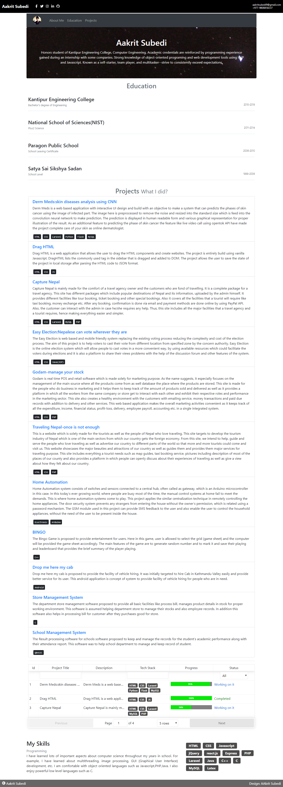

<h1>
    Make your <code>Portfolio</code>
</h1>
<h3>Introduction</h3>

    React Portfolio is a project in react.js. The output screenshots are attached below.

    

<h3>Create your portfolio</h3>
<ul>
    <li>Clone the repo</li>
    <ul>
        <li>route to the directory in terminal</li>
        <li>git clone git@github.com:aakritsubedi/react-portfolio.git</li>
        <li>open the folder in the editor of your choice</li>
    </ul>
    <b>or, simply download the zip file from </b><a href='https://github.com/aakritsubedi/react-portfolio'>https://github.com/aakritsubedi/react-portfolio</a>
    <li>route to the directory in terminal</li>
    <li>yarn install/ npm install - installs all the dependencies and packages</li>
    <li>yarn start/ npm start</li>
    <b>-all the basic installation to run react application should be configured</b>
     
    <b>Editing and Updating your info</b>
    <li>open the folder in the code editor of your choice</li>
    <ul>
        <li>route to <b>src/Constants/myInfo.js</b> file</li>
        <li>my necessary changes</li>
        <b>Don't remove any variable. Only change the content of the variable defined in the <code>myInfo.js</code> file.
    </ul>
    <li>Visit localhost:3000 </li>
</ul>